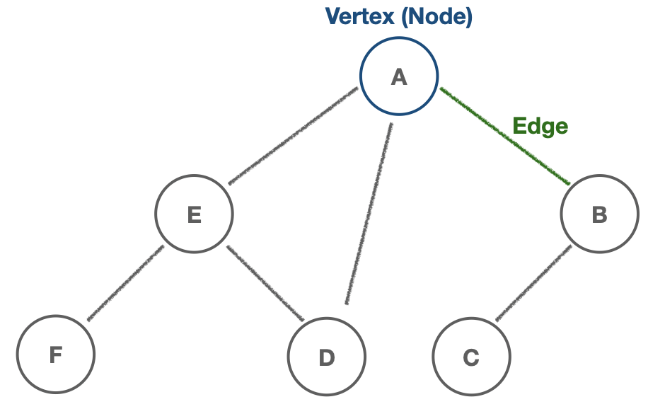
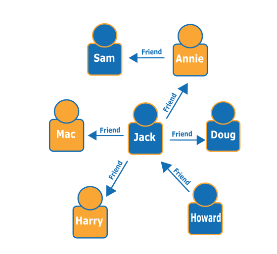

# DFS/ BFS

#### 🔑대표적 그래프(Graph) 탐색 알고리즘인 DFS/BFS를 소개합니다.

> ## 그래프(Graph)는 뭘까?
> * **그래프(Graph)** 는 정점(`vertex`, 노드)과 간선(`edge`)로 구성된 유한한(finite) 자료구조 입니다.
> * 두 정점(노드)가 간선으로 연결되면 '두 노드는 인접(Adjacent)하다' 라고 합니다.
> 
> 
> 
> * Facebook, Instagram 같은 소셜 네트워크의 데이터베이스가 그래프 구조로 만들어져 있습니다. 그래프 구조를 통해 **사람들(`node`) 사이의 관계(`edge`)** 를 쉽게 탐색할 수 있습니다.
> 

## 그래프 탐색
* 하나의 정점(노드)에서 모든 노드를 *한 번씩 탐색(방문)* 하는 것을 말합니다.

## DFS(Depth-First Search, 깊이 우선 탐색)

* 그래프의 최대 깊이까지 탐색한 후, 다른 경로로 이동하여 탐색하는 알고리즘입니다.
  * 최대한 멀리 있는 노드를 우선 탐색합니다.

* **스택**과 **재귀함수**를 이용하여 구현할 수 있습니다.

  * DFS 구현 예시
    ```js
    class Graph {
      constructor() {
        this.adjacencyList = {};
      }
      // 정점(노드) 추가
      addVertex(vertex) {
        if (!this.adjacencyList[vertex]) this.adjacencyList[vertex] = [];
        return this.adjacencyList;
      }
      // 간선 추가
      addEdge(vertex1, vertex2) {
        this.adjacencyList[vertex1].push(vertex2);
        this.adjacencyList[vertex2].push(vertex1);
        return this.adjacencyList;
      }
      
      // 탐색 시작 노드 인자
      DFS(start) {
        const result = []; // 탐색 결과 배열
        const visited = {}; // 방문한 노드 체크(각 노드를 한 번씩만 처리하도록)
        const adjacencyList = this.adjacencyList;

        function dfs(vertex) {
          // 정점이 빈 값이면 null을 반환
          if (!vertex) return null;
          // 시작 노드를 스택에 push하고 방문 처리
          visited[vertex] = true;
          // 탐색 결과 배열에 노드 push
          result.push(vertex);
          // 인접 리스트를 순회하면서 현재 노드와 연결된 다른 노드 방문 처리
          adjacencyList[vertex].forEach((v) => {
            // 방문하지 않은 인접 노드 방문 처리(재귀)
            if (!visited[v]) dfs(v);
          });
        }
        dfs(start);
        return result;
      }
    }
    const graph = new Graph();
    graph.addVertex("A");
    graph.addVertex("B");
    graph.addVertex("C");
    graph.addVertex("D");
    graph.addVertex("E");
    graph.addVertex("F");

    graph.addEdge("A", "B");
    graph.addEdge("A", "C");
    graph.addEdge("B", "D");
    graph.addEdge("C", "E");
    graph.addEdge("D", "E");
    graph.addEdge("D", "F");
    graph.addEdge("E", "F");

    graph.DFS("A")  //  ["A", "B", "D", "E", "C", "F"]
    ```

***

## BFS(-First Search, 너비 우선 탐색)

* 그래프의 근접 노드부터 탐색한 후, 다른 경로로 이동하여 탐색하는 알고리즘입니다.
  * 최대한 가까운 노드부터 우선 탐색합니다.

* **큐**를 이용하여 구현할 수 있습니다.

  * BFS 구현 예시

    ```js
    class Graph {
      constructor() {
        this.adjacencyList = {};
      }
      // 정점(노드) 추가
      addVertex(vertex) {
        if (!this.adjacencyList[vertex]) this.adjacencyList[vertex] = [];
        return this.adjacencyList;
      }
      // 간선 추가
      addEdge(vertex1, vertex2) {
        this.adjacencyList[vertex1].push(vertex2);
        this.adjacencyList[vertex2].push(vertex1);
        return this.adjacencyList;
      }
      
      BFS(start) {
        const result = [];
        const visited = {};
        let vertex; // 현재 노드
        const adjacencyList = this.adjacencyList;
        // 탐색 시작 노드를 큐에 넣고, 방문 처리
        const queue = [start];
        visited[start] = true;
        // 큐가 비어있을 때까지 반복
        while (queue.length) {
          // console.log(queue);
          vertex = queue.shift(); // 
          result.push(vertex);
          // 인접 리스트를 순회하여 방문하지 않은 인접 노드
          // 큐에 push하고, 방문 처리
          adjacencyList[vertex].forEach((v) => {
            if (!visited[v]) {
              queue.push(v); 
              visited[v] = true;
            }
          });
        }
        return result;
      }
    }
    const graph = new Graph();
    graph.addVertex("A");
    graph.addVertex("B");
    graph.addVertex("C");
    graph.addVertex("D");
    graph.addVertex("E");
    graph.addVertex("F");

    graph.addEdge("A", "B");
    graph.addEdge("A", "C");
    graph.addEdge("B", "D");
    graph.addEdge("C", "E");
    graph.addEdge("D", "E");
    graph.addEdge("D", "F");
    graph.addEdge("E", "F");
    
    graph.BFS("A")  //   ["A", "B", "C", "D", "E", "F"]
    ```

### Big-O

  * 시간 복잡도는 두 탐색 알고리즘 모두 `O(N)` (N: 그래프 노드의 개수) 이 소요됩니다. 

***

### Reference

[Graph | AWS](https://aws.amazon.com/ko/nosql/graph/)

[Graphs: breadth-first search | freeCodeCamp](https://www.youtube.com/watch?v=wu0ckYkltus)