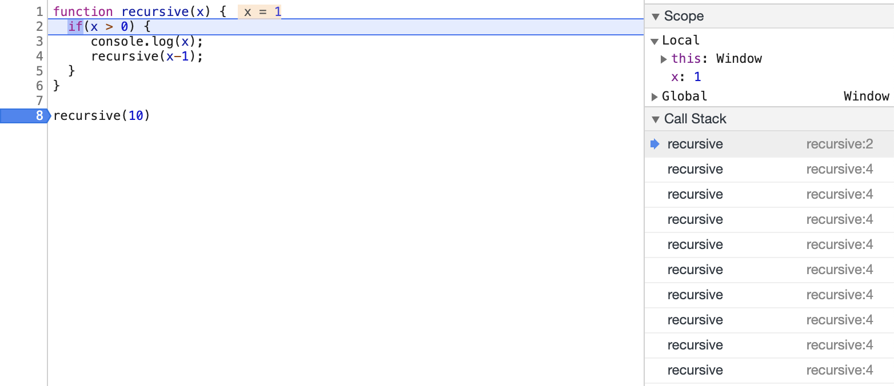

## 재귀(Recursion)

- 자기 자신을 호출하는 과정/함수(A process/function that calls itself)
- 입력값이 다른 동일한 함수를 `base case`에 도달하기 전까지 호출
  (Invoke the same function with a different input until you reach your base case)

  - `Base Case`: 재귀가 멈추는 조건 (Condition that recursion ends)
  - `Recursive Case`: 재귀가 시작하는 조건(Condition that resumes recursion)

    ```js
    function countDown(num) {
      if (num <= 0) {
        console.error("Finish!");
        return; // Base Case
      }
      console.log(num);
      num--;
      countDown(num);
    }
    countDown(10);
    ```

### 재귀함수와 콜스택(Recursive functions and CallStack)

- 재귀함수는 반복해서 함수를 콜스택에 추가
  ```js
  function recursive(x) {
    if (x > 0) {
      console.log(x);
      recursive(x - 1);
    }
  }
  ```
  

  > ### 💡재귀 호출의 콜스택으로 인한 추가적인 메모리 필요
  > 
  > * 재귀 호출 운영체제의 메모리 스택에 저장되어야 하기 때문에 재귀 알고리즘은 추가적인 공간 복잡도 비용이 필요합니다.
  > * 콜스택이 n만큼 호출된 경우 공간복잡도는 O(n)입니다.
  > * 때에 따라서 재귀 보다 반복 루프를 활용한 해결책도 고려해야 합니다.
  > * 잘못 구현된 재귀함수는 스택 오버플로우(stack overflow) 오류를 일으켜 프로그램을 중단시킬 수 있습니다. 

### ※ 재귀함수 필수 요소

1. **`Base Case`**

   ```js
   function factorial(num) {
     // if(num === 1) return 1;  // 👿No base case
     return num * factorial(num - 1);
   }
   // Maximun call stack size exceeded(Stack overflow)
   ```

2. **`Return`**

   ```js
   function factorial(num) {
     if (num === 1) console.log(1); // 👿No return
     return num * factorial(num - 1);
   }

   function factorial(num) {
     if (num === 1) return 1;
     return num * factorial(num); // 👿Wrong return!
   }
   // Maximun call stack size exceeded(Stack overflow)
   ```
