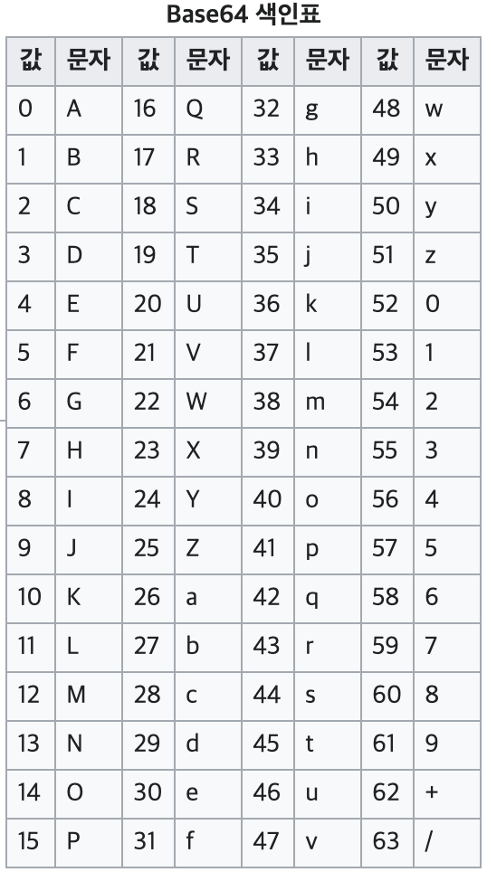

# Base 64

```js
// data string
let str = base 64;

// base 64 encoding
window.btoa(str);
// "YmFzZSA2NA=="

// base 64 decoding
window.atob("YmFzZSA2NA==")
// "base 64"
```

* [`binary-to-text encoding`](https://en.wikipedia.org/wiki/Binary-to-text_encoding)

* **이진(binary) 데이터**를 *ASCII 코드*의 일부(A-Z, a-z, 0-9 + 기호)와 매칭되는 **문자열로 변환**하는 인코딩 방식
  * 기존 데이터보다 약 33% 길이 증가
  * 데이터가 작을 수록 증가폭 더 클 수 있음
    ```js
    let str = "a";    // length: 1
    
    window.btoa(str); // length: 4
    // "YQ=="      
    ```
  * 대부분 `=` 또는 `==`로 끝나는 문자열

    

> ## 💡Base 64 사용하는 이유?
> * 이진 데이터를 **문자열(텍스트) 기반 데이터**로 처리할 수 있기 떄문에
>   * 이미지, zip 파일 등을 문자열 기반 데이터(XML, JSON, RESTful API 등)에 포함해야 하는 경우,
      파일을 base 64로 인코딩하면 UTF-8과 호환 가능
> * 패딩(`=`, `==`) 추가하는 이유?
>   * JSON, HTTP body 처럼 데이터 길이가 명시적으로 구분되는 경우는 상관 없지만, TCP 처럼 스트림 형태라면 문제가 될 수 있음.


***

### Reference

[Base 64 | Wiki](https://ko.wikipedia.org/wiki/%EB%B2%A0%EC%9D%B4%EC%8A%A464)

[Base 64 | MDN](https://developer.mozilla.org/en-US/docs/Glossary/Base64)

[Base 64 encoding: btoa()](https://developer.mozilla.org/en-US/docs/Web/API/WindowOrWorkerGlobalScope/btoa)

[Decode from Base64 format - Tool](https://www.base64decode.org/)