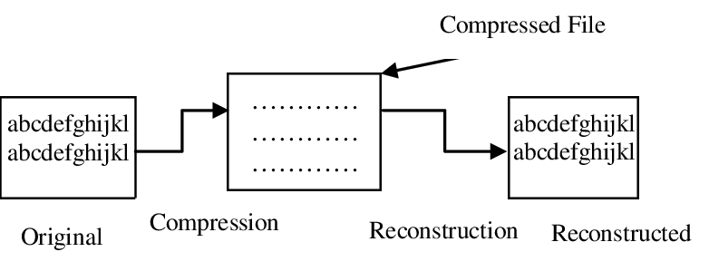

# Data Compression(데이터 압축)

> * 데이터의 중복된 부분을 하나로 묶어 효율적으로 인코딩(최적화)
>
>   ex) `"AAA"` => `"3A"`

* [**DEFLATE**](https://en.wikipedia.org/wiki/Deflate) 알고리즘
  * `zip` 파일을 **압축**할 때 사용되는 알고리즘
* **INFLATE** 알고리즘
  * `zip` 파일을 **압축 해제**할 때 사용되는 알고리즘

    


* [`zlib`](https://en.wikipedia.org/wiki/Zlib)
  * DEFLATE 압축 표준을 제공하는 무료 라이브러리

## 손실 압축, 무손실 압축

* 손실 압축(Loss Compression): 압축 시 원본 데이터 손실(`jpeg`)
  * 압축한 파일 재구성 불가/ 압축률 높음
  * 멀티미디어 분야(비디오, 오디오 데이터)에서 주로 사용

* 무손실 압축(Lossless Compression): 압축 시 원본 데이터 무손실(`png`)
  * `DEFLATE` 알고리즘을 통한 압축
  * 압축한 파일 재구성 가능. 원본 데이터 유지/ 압축률 상대적으로 낮음
  * 웹, 서버 데이터 통신에서 주로 사용 

## 압축률

```
원본 데이터 크기 / 압축 데이터 크기
```

> ※ 압축률 높을수록 압축 해제 시 더 많은 CPU 자원 사용

  * 압축 레벨: 1 ~ 10 단계 지정. 레벨이 높을수록 압축률 높아짐
  * 압축 속도: 속도가 빠를수록 압축률 낮아짐. 최적화된 알고리즘 사용
  * 압축 해제 속도: 압축 속도보다 해제 속도가 일반적으로 *빠름*

  ### 체크섬(Checksum)

  * 데이터를 받는 쪽에서 ***데이터 유실 및 변조 여부 확인***하기 위해 계산하여 비교하는 값
    > ※ 데이터 무결성을 보장하지 않는 환경(`UDP` 등)의 경우 체크섬으로 검증 필요

***
### Reference

[Data Compression | Wiki](https://en.wikipedia.org/wiki/Data_compression)

[학교에서 알려주지 않는 17가지 실무 개발 기술](http://www.kyobobook.co.kr/product/detailViewKor.laf?mallGb=KOR&ejkGb=KOR&barcode=9791162242988)

[ZIP: Data Compressions - Huffman code, DEFLATE](https://speakerdeck.com/dalinaum/zip-data-compression-20bunmane-baeuneun-abcug-algorijeum?slide=8)

***

[Image File Types](https://modassicmarketing.com/insights/articles/understanding-image-file-types)

[Checksum | overcoded](https://www.overcoded.net/internet-checksum-calculation-steps-044921/)

[텍스트 기반 자산의 인코딩 및 전송 크기 최적화 | Google web](https://developers.google.com/web/fundamentals/performance/optimizing-content-efficiency/optimize-encoding-and-transfer?hl=ko)