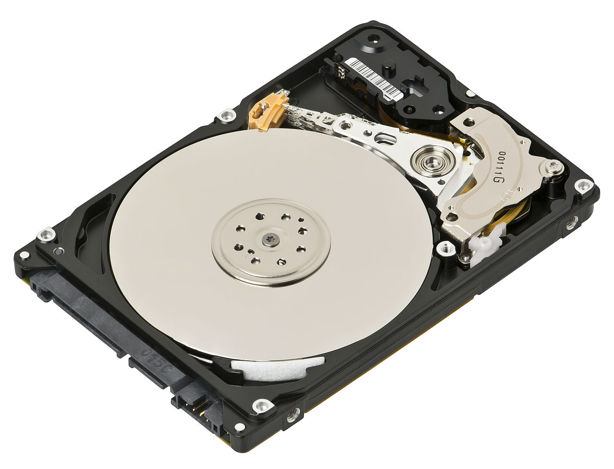
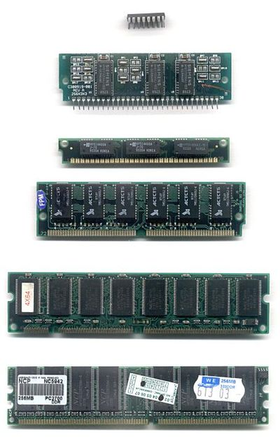
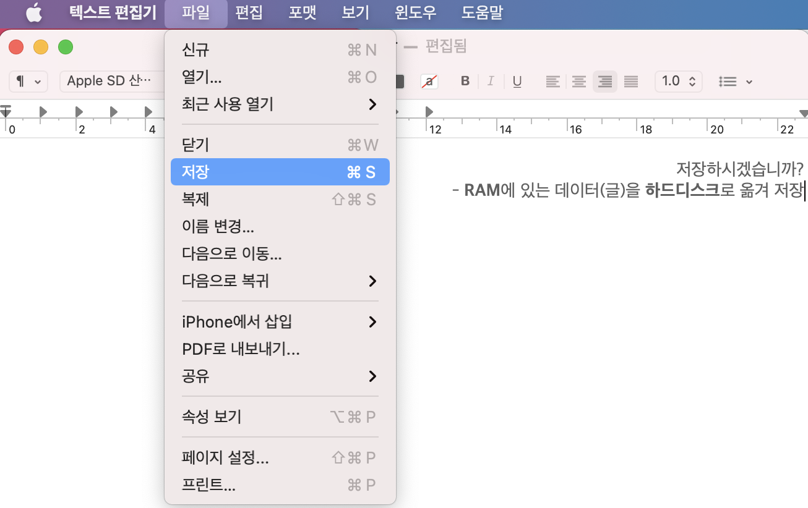

# 컴퓨터의 저장장치: 하드디스크, 메모리(RAM)

> ### `저장장치(Storage)`는 데이터를 일시적 또는 긴 기간 저장하기 위해 사용하는 장치
> * 컴퓨터는 다양한 저장장치를 사용하여 *효율적으로* 작업을 처리합니다. 

## 1. 하드 디스크(Hard Disk, Hard Drive, HDD)
  
  

  * 컴퓨너의 `보조기억장치`로 데이터 접근 속도가 비교적 느립니다. 
  
  * 오래 보관할 데이터를 저장하기 위해 사용합니다. 
  * 컴퓨터 전원이 공급되지 않아도 저장한 데이터가 사라지지 않습니다.(`비휘발성`)

  
## 2. 메모리(Random Access Memory, RAM)

  

  * 컴퓨터의 `주기억장치`로 데이터 접근 속도가 HDD보다 빨라 성능이 좋습니다.
  
  * 컴퓨터 전원이 꺼지면 저장한 데이터가 사라집니다.(`휘발성`)
  
  
  > ✅ 컴퓨터의 CPU는 처리할 데이터를 **하드디스크**에서 가져와서 **메모리(RAM)** 에 올려놓고 일을 처리합니다. 
  >
  > * 텍스트 편집기로 작성 중인 글은 RAM에 올려져 있습니다. 텍스트 편집기 창을 닫을 때 
  >   * '저장 안함'을 선택하면 하드 디스크에 저장되지 않고 프로그램이 종료됩니다. '저장'하면 작성하던 글이 하드디스크에 저장됩니다. 
  > 
  > 

  > ✅ RAM이 하드디스크보다 비싼 이유는?
  > 
  > * RAM은 반도체로 인해 매우 비싼 반면 하드드라이브는 마그네틱 테이프 사용으로 인해 가격이 저렴합니다.
  >   
  > * RAM은 **속도**를 높이는 데 사용되고 하드 디스크는 **저장 공간**을 늘리는 데 사용됩니다. 
  >   * RAM 크기는 보통 `4 ~ 32GB`, 반면 하드디스크는 `1 ~ 3TB`
  >   * 처리 속도는 CPU > 레지스터 > 캐시 > 메모리(RAM) > 하드디스크 순서로 빠릅니다. 
  >
  > 
  

## 💡정리
  |특징   |   |예시|
  |------|---|---|
  |용도|주기억장치|RAM, ROM|
  |   |보조기억장치|HDD(하드디스크), SSD, DVD, USB|
  |휘발성|휘발성 메모리|RAM|
  |     |비 휘발성 메모리|HDD, SSD, ROM|

***

### Reference

[Hard Drive vs. RAM](https://www.educba.com/hard-drive-vs-ram/)

[RAM vs. HDD | geeksforgeeks](https://www.geeksforgeeks.org/difference-between-random-access-memory-ram-and-hard-disk-drive-hdd/)

[Memory vs. Storage](https://www.enterprisestorageforum.com/hardware/memory-vs-storage/)

[메모리 계층구조](https://diveintosystems.org/antora/diveintosystems/1.0/MemHierarchy/mem_hierarchy.html)

