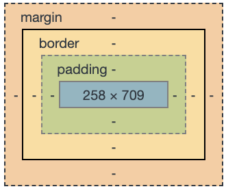

# CSS box model

브라우저 렌더링 과정에서 레이아웃(배치)할 때, 브라우저의 렌더링 엔진은 CSS 박스 모델에 따라 각각의 HTML 요소를 사각형 박스로 표현합니다. (브라우저는 웹 화면에 보여줘야 하는 모든 HTML 요소들을 사각형의 박스로 인식합니다. 각각의 HTML 태그들이 하나의 박스라고 이해하면 됩니다.) CSS는 박스의 크기, 위치, 속성(색, 배경, 테두리 모양 등)을 결정합니다.

하나의 박스는 **margin,** **border**, **padding**, **content** 영역으로 이루어져 있습니다. top-right-bottom-left(시계방향) 순서로 속성값을 입력하거나, margin-top과 같이 분리하여 사용할 수 있습니다.

박스의 크기는 **width**, **height**로 지정합니다.

- **margin**(바깥 여백): border와 이웃하는 요소 사이의 간격입니다.
- **border**(테두리): content와 padding을 감싸는 경계입니다. margin과 padding을 나누는 기준이 됩니다.
- **padding**(안쪽 여백): border와 content 사이 공간입니다.
- **content**: 텍스트, 이미지가 포함된 박스의 실질적 내용 부분입니다.

---

(블로깅 주소: https://www.notion.so/Front-end-css-box-model-8f4f6b20e8ef42938508e7c161e8655b)
