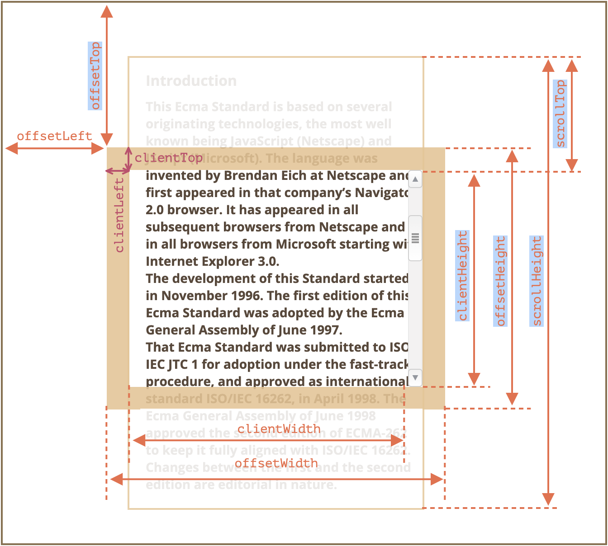
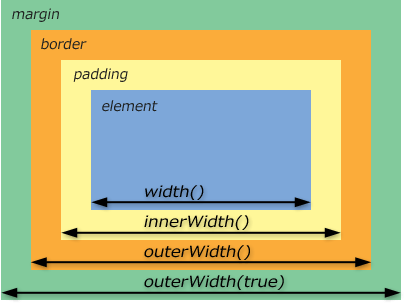
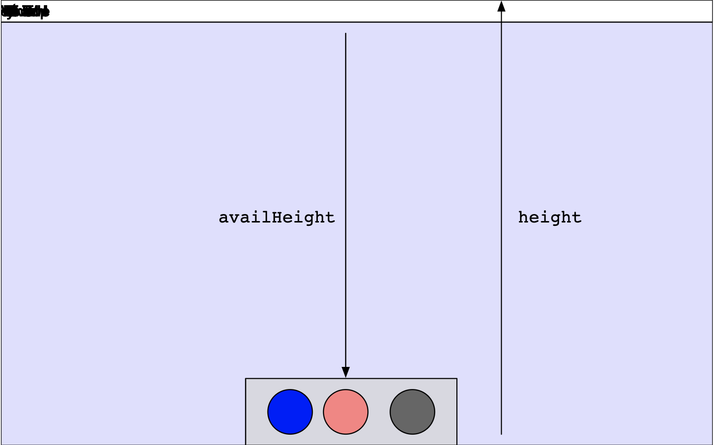

## CSS와 JavaScript

> 🚫대부분 스타일의 경우 자바스크립트로 CSS 조작 하는 것보다 CSS로 하는 것이 좋습니다.

1. JavaScript로 CSS 설정

   ```js
     document.querySelector("selectors").style.backgroundColor = "yellow";
     document.querySelector("selectors").style.WebkitOverflowScrolling = "touch" | "auto;
   ```

2. JavaScript로 _읽기 전용_ CSS 객체([CSSStyleDeclaration](https://developer.mozilla.org/en-US/docs/Web/API/CSSStyleDeclaration)) 반환

   ```js
     window.getComputedStyle(element[, pseudoElt]);

     let div = document.querySelector('div');
     let color = window.getComputedStyle(div).getPropertyValue('color');
   ```

3. JavaScript로 CSS **너비**, **높이** 값 탐색

     

   ```js
   document.querySelector("selectors").offsetWidth;
   document.querySelector("selectors").clientHeight;
   document.querySelector("selectors").scrollWidth;
   ```

   ***

     

   ```js
   window.innerWidth; // border 내부 너비
   window.innerHeight; // border 내부 높이
   ```

   ※ `innerWidth`, `innerHeight`는 읽기 전용

   - 너비, 높이 변경: [`window.resizeTo`](https://developer.mozilla.org/en-US/docs/Web/API/Window/resizeTo)

   ***

   

   ```js
   window.screen.availWidth; // 실제 사용 가능한 화면 너비
   window.screen.availHeight; // 실제 사용 가능한 화면 높이
   ```

---

### Reference

[getComputedStyle | MDN](https://developer.mozilla.org/ko/docs/Web/API/Window/getComputedStyle)

[요소 사이즈와 스크롤 | JS Info](https://ko.javascript.info/size-and-scroll)

[CSS와 관련된 자바스크립트](https://www.zerocho.com/category/JavaScript/post/5aa23cd4e70ee8001bc60b9a)
