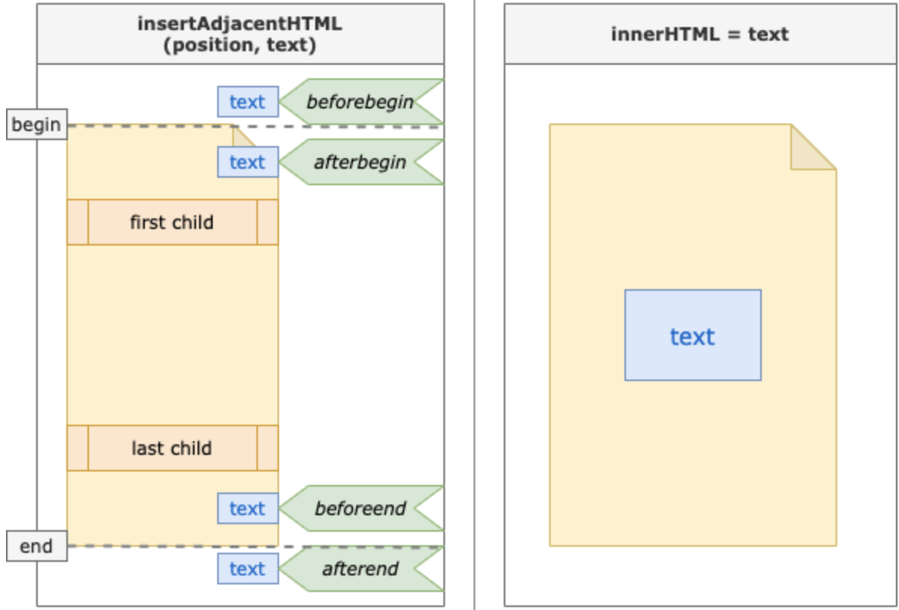

# DOM Element

## Element methods

### [closest](https://developer.mozilla.org/ko/docs/Web/API/Element/closest)
* 특정 CSS 선택자와 일치하는 가장 가까운 요소를 DOM 트리에서 검색한다.
* 파라미터: 선택자(selector)
  ```js
  const $userName = e.target.closest("li").querySelector(".user-name");
  ```

### [insertAdjacentHTML](https://developer.mozilla.org/ko/docs/Web/API/Element/closest)
* HTML, XML과 같은 특정 텍스트를 파싱하고, 현재 요소를 기준으로 지정된 위치에 HTML형식 텍스트를 추가한다.
* 파라미터: **위치(position)**, **추가할 텍스트(text)**
  ```js
  document.querySelector("#user-list")
  .insertAdjacentHTML(
    "beforeend",   // 기존 요소 다음에 추가
    userName)
  ```

  > ### 💡innerHTML vs. insertAdjacentHTML 
  > **`innerHTML`** 
  > ```js 
  > element.innerHTML = text;
  > ```
  > * 하위 요소에 대한 JS 참조가 모두 제거된다 -> **기존 노드를 모두 삭제한 후 재구성**한다.
  >  
  > **`insertAdjacentHTML`**
  > ```js
  > insertAdjacentHTML(position, text);
  > ```
  > * 기존 JS 참조가 영향을 받지 않는다 -> 지정한 위치에 노드가 추가될 뿐 **기존 노드가 변경되지 않는다**.
  > 
  > 🔥 요소를 다시 **직렬화**(serialization), **파싱**하는 과정을 거치지 않기 때문에 `insertAdjacentHTML`이 `innerHTML`보다 빠르지만, 콘텐츠가 많아질수록 추가 속도는 느려진다.
  > 
  > 

***

### Reference

🔗[insertAdjacentHTML vs. innerHTML | dev.to](https://dev.to/jeannienguyen/insertadjacenthtml-vs-innerhtml-4epd)

🔗[insertAdjacentHTML 과 innerHTML의 차이](https://saeatechnote.tistory.com/entry/insertAdjacentHTML-%EA%B3%BC-innerHTML%EC%9D%98-%EC%B0%A8%EC%9D%B4)

