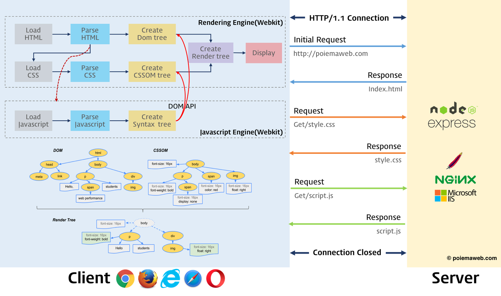
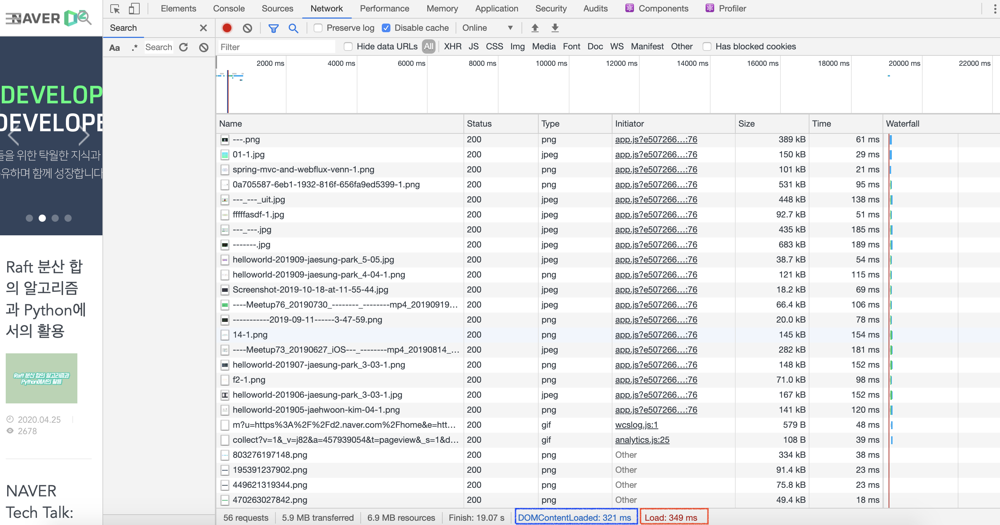
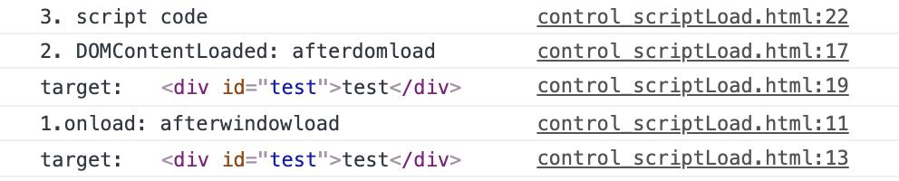

# <script> tag의 위치

- HTML의 `<script>`태그는 실행 가능한 코드를 문서에 포함하거나 참조할 때 사용합니다. 보통은 자바 스크립트 코드와 함께 사용합니다.
- HTML에서 `<script>`태그는 body 태그 안의 **최하단에 위치** 해야 합니다.

- 브라우저는 서버로부터 응답 받은 HTML 파일을 렌더링 엔진을 통해 읽고, 파싱한 다음 DOM 트리를 생성하는 순서로 동작합니다.
- 하지만 브라우저가 HTML 파일의 태그들을 읽어 나가는 중에 `<script>` 태그를 만나면 파싱을 중단하고, 자바 스크립트 파일을 로드 한 후, 자바 스크립트 코드를 파싱 합니다. 이 작업이 완료하면 중단되었던 HTML 파싱이 다시 시작됩니다.

  

- `<script>` 태그가 HTML 태그들 사이에 위치하면

        1. HTML을 읽는 과정에서 자바 스크립트 로드와 파싱을 위해 중단되는 시점이 생기고, 따라서 그 만큼 화면에 표시되는 것(display)이 지연됩니다.

        2. HTML 파싱이 끝나고 DOM 트리가 렌더링 되기 전에 자바 스크립트가 실행되어 DOM 조작을 할 경우 에러가 발생할 수 있습니다.

  ```html
  <!-- script.html -->
  <!DOCTYPE html>
  <html>
    <head>
      <meta charset="UTF-8" />
      <title></title>
    </head>
    <body>
      <script src="./script.js"></script>
      // dom 트리가 렌더링 되기 전에 DOM 조작(error)

      <input type="button" id="dom" value="Hello world" />

      <script src="./script.js"></script>
      // dom 트리가 렌더링 된 후 DOM 조작(working)
    </body>
  </html>
  ```

  ```javascript
  // script.js
  var dom = document.getElementById("dom");
  dom.addEventListener("click", function () {
    alert("Hello world");
  });
  ```

## <script> 로딩 순서 제어

- `<script>` 태그가 body의 최하단에 위치할 수 없는 경우

  - `<script>` 태그의 `async` 속성으로 로딩 순서를 제어하거나,

  ```html
  <script async src="script.js">
  ```

  - `<script>` 태그의 `defer` 속성으로 로딩 순서를 제어하거나,

  ```html
  <script defer src="script.js">
  ```

  - **DOMContentLoaded** 와 **onload** 활용하여 script 내부에서 로딩 순서 제어할 수 있습니다.

    - **DOMContentLoaded** 내부의 코드는 DOM 생성이 끝난 후 실행됩니다.
    - **onload** 내부의 코드는 문서에 포함된 모든 콘텐츠 (images, script, css...) 가 전부 로드 된 후에 실행됩니다.

      

      
