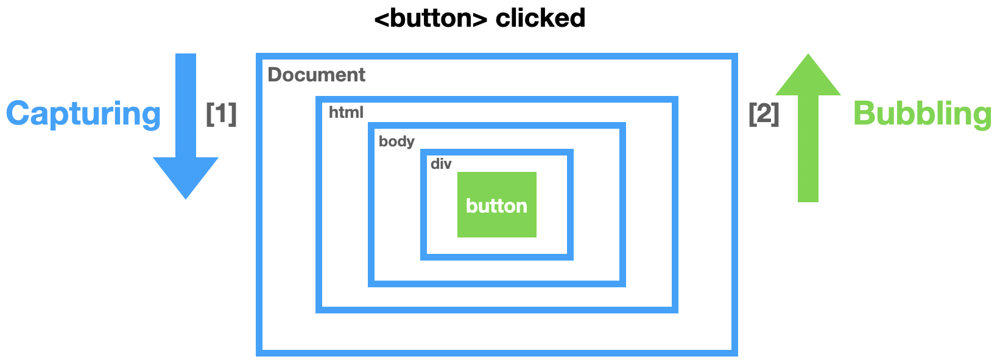

# DOM Event

```html
<!DOCTYPE html>
<html lang="en">
  <head>
    <meta charset="UTF-8" />
    <meta name="viewport" content="width=device-width, initial-scale=1.0" />
    <title>Event Listener</title>
    <link rel="stylesheet" href="style.css" />
    <script src="./script.js" defer></script>
  </head>
  <body>
    <div class="grandparent">
      <div class="parent">
        <div class="child"></div>
      </div>
    </div>
  </body>
</html>
```

## Add Event(이벤트 등록): addEventListener

- 동적 기능(사용자 입력 등) 추가

  ```js
  document.addEventListener("click", (e) => {
    console.log("Document", e.target);
  });
  ```

---



## Event Capturing(이번트 캡처링)

- `Capture In`

- 이벤트가 발생했을 때 **하위 요소**로 이벤트 전달

- `Document` > `HTML` > `body` > `div` > `button`(event target)

  - `addEventListener`에 `capture:true` 옵션 추가

    ```js
    grandparent.addEventListener(
      "click",
      (e) => {
        console.log("Grandparent", e.target);
      },
      { capture: true }
    );
    ```

## Event Bubbling(이번트 버블링)

- `Bubble Out`

- 이벤트가 발생했을 때 **상위 요소**로 이벤트 전달

- `button`(event target) > `div` > `body` > `HTML` > `Document`

---

### stopPropagation

- 이벤트 전달 방지

  ```js
  parent.addEventListener(
    "click",
    (e) => {
      e.stopPropagation(); // event delivery stops at "Parent Capture"
      console.log("Parent Capture", e.target);
    },
    { once: true }
  );
  ```

### option: once

- 한번만 실행하고 제거

  - `addEventListener`에 `once:true` 옵션 추가

    ```js
    parent.addEventListener(
      "click",
      (e) => {
        console.log("Parent Capture", e.target);
      },
      { once: true }
    );
    ```

## Remove Event(이벤트 제거): removeEventListener

- 할당된 이벤트 제거

  ```js
  //*** Remove printHi event after 2 seconds
  parent.addEventListener("click", printHi);

  setTimeout(() => {
    parent.removeEventListener("click", printHi);
  }, 2000);

  function printHi() {
    console.log("Hi");
  }
  ```

## Event Delegation(이벤트 위임)

- 이벤트 캡처링과 버블링 활용하여 **이벤트 위임** 구현

- 요소마다 이벤트 핸들러를 할당하지 않고, <u>상위 요소에서 하위 요소의 이벤트 제어</u>

```js
onst divs = document.querySelectorAll("div");

// 상위 요소 document에 클릭이벤트 할당하여 모든 자식 요소 제어
// 하위에서 발생한 클릭 이벤트 상위 요소에서 감지(이벤트 버블링)
document.addEventListener("click", (e) => {
  if (e.target.matches("div")) {
    console.log("hi");
  }
});

addGlobalEventListener("click", "div", (e) => {
  console.log("hi");
});

function addGlobalEventListener(type, selector, callback) {
  document.addEventListener(type, (e) => {
    if (e.target.matches(selector)) callback(e);
  });
}
```

---

### Reference

[DOM Event | JS Info](https://ko.javascript.info/events)

[Event Bubbling & Capturing](https://joshua1988.github.io/web-development/javascript/event-propagation-delegation/)
