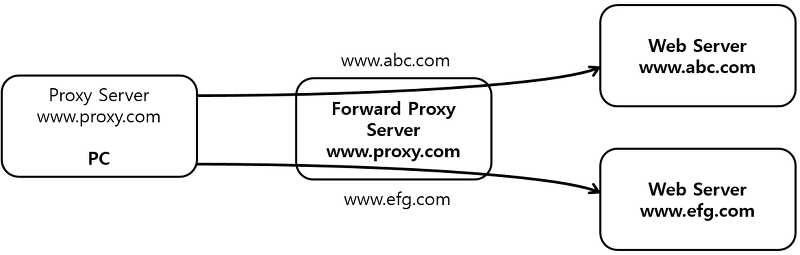

# Forward Proxy

- **Forward Proxy 또는 Proxy** 는 클라이언트 대신 서버로 요청을 보냅니다.
  
  ⇒ **Client side Proxy**
  
  서버에게 **클라이언트** 가 누구인지 감추는 역할을 합니다.

     
      
     1. 클라이언트는 `www.proxy.com`을 프록시 서버로 설정합니다.
     2. 클라이언트에서 **웹** **서버 URL** (`www.abc.com`, `www.efg.com`)로 요청을 보냅니다.
     3. **Forward Proxy** 는 요청을 받아 클라이언트를 대신하여 웹 서버에 요청합니다.
     4. **Forward Proxy** 는 요청을 캐싱 합니다.
      - 주로 웹 콘텐츠 필터링, [NAT(네트워트 주소 변환)](https://hack-gogumang.tistory.com/49), 이메일 보안 등에 사용됩니다.
      
      

---

※ Reference

https://ssup2.github.io/theory_analysis/Forward_Proxy_Reverse_Proxy/

https://ipwithease.com/forward-proxy-vs-reverse-proxy/
