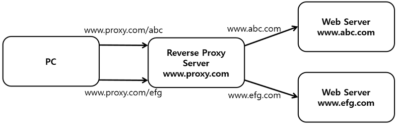

# Reverse Proxy

- **Reverse Proxy** 는 서버의 응답을 대신 클라이언트에게 전달 합니다.
  ⇒ **Server side Proxy**
  클라이언트에게 **서버** 가 누구인지 감추는 역할을 합니다.

      

      1. 프록시 서버를 미리 설정하지 않습니다.
      2. 클라이언트는 프록시 서버를 실제 웹 서버처럼 생각하고 **Reverse Proxy URL**(`www.proxy.com/abc`, `www.proxy.com/efg`)로 요청을 보냅니다.
      3. **Reverse Proxy**는 URL에 따라 실제 웹 서버에 요청을 보냅니다. (`www.abc.com`, `www.efg.com` )
      4. **Reverse Proxy**를 통해 캐싱 뿐만 아니라 **Load Balancing**의 역할도 수행합니다.
      - [Load Balancing(여러 서버에 분산 처리)](https://ko.wikipedia.org/wiki/%EB%B6%80%ED%95%98%EB%B6%84%EC%82%B0), Content Switching(웹 페이지분리, 다국어 버전), 웹 방화벽 등에 사용됩니다.

---

※ Reference

https://ssup2.github.io/theory_analysis/Forward_Proxy_Reverse_Proxy/

https://ipwithease.com/forward-proxy-vs-reverse-proxy/
