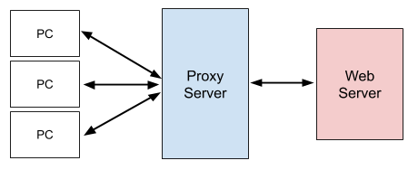

# Proxy(프록시)

- **프록시**(**Proxy)** 는 클라이언트-서버 사이를 **중계 해주는 기능** 을 의미합니다.

  

  - **프록시 서버** 는 클라이언트와의 사이에서 **대리 통신(중계 기능)을 수행** 합니다.
  - 프록시 서버에는 클라이언트가 요청한 파일, 네트워크 연결, 웹 페이지 등의 자원들이 **캐시** 로 저장되어 있습니다.
  - 클라이언트가 동일한 자원을 요청할 때 (웹 서버에 접속할 필요 없이) 프록시 서버 내의 저장된 캐시 정보를 제공할 수 있습니다. 따라서 자원의 응답 속도가 빨라지고, 서버와 프록시 서버 사이의 통신이 일어나지 않았기 때문에 서버 측의 네트워크 비용이 감소합니다.
  - 또한 **보안** 측면에서도 프록시 서버 측에서 위험이 예상되는 웹 콘텐츠 및 악성코드를 필터링 하여 클라이언트 측의 보안을 향상시킬 수 있습니다.

---

※ Reference
https://ko.wikipedia.org/wiki/%ED%94%84%EB%A1%9D%EC%8B%9C_%EC%84%9C%EB%B2%84

https://dany-it.tistory.com/107

https://www.joinc.co.kr/w/Site/System_management/Proxy
