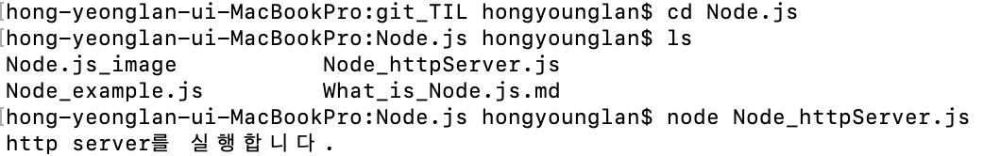

### `Node.js` 로 http server 구축

- VsCode - Node.js 폴더 안에 Node_httpServer.js 파일 생성
  ```jsx
  // Node.js로 http server 구축
  const http = require("http");
  http
    .createServer((req, res) => {
      res.write("Hello Node Server");
      res.end();
    })
    .listen(8080);
  ```


    console.log("http server를 실행합니다.");
    ```

- node terminal에서 **node** Node_httpServer.js 실행
  

- [http://localhost:8080](http://localhost:8080)으로 접속해서 http server 생성 확
  
