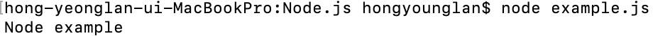

# JavaScript & Node.js

`JavaScript`는 웹 서비스를 구축할 때 화면 구성이나 데이터 전송을 효율적으로 제작하기 위해 개발된 **웹 브라우저 위에서 동작하는** 언어입니다.


`Node.js`는 [자바 스크립트 엔진](https://v8.dev/)을 이용하여 **서버에서도 자바 스크립트 코드가 작동할 수 있도록 구현한 환경**입니다. ("서버 측 자바 스크립트")


    #### `Node.js` 로 http server 구축
    - VsCode - Node.js 폴더 안에 Node_httpServer.js 파일 생성

    ```jsx
    // Node.js로 http server 구축

    const http = require("http");
    http
      .createServer((req, res) => {
        res.write("Hello Node Server");
        res.end();
      })
      .listen(8080);

    console.log("http server를 실행합니다.");
    ```

    - node terminal에서 **node** Node_httpServer.js 실행

    

    - [http://localhost:8080](http://localhost:8080)으로 접속해서 http server 생성 확

    

- `JavaScript` 는 웹 브라우저 안에서 실행 해야만 구동이 가능했는데 `Node.js` 를 활용하면 리눅스와 같은 서버 환경에서도 JavaScript를 **_브라우저 밖에서_** node 명령어로 실행시켜 결과나 기능을 구동할 수 있습니다.

  - VsCode - Node.js 폴더 안에 example.js 파일 생성

  ```jsx
  // example.js
  console.log("Node example");
  ```

- node terminal에서 **node** example.js 실행

  

`Node.js` 만으로 서버 코드 전체를 개발하려면 많은 부분을 자체 제작해야 하기 때문에 `Express.js`와 같은 유용한 프레임 워크 또는 라이브러리를 조합하여 사용합니다.

---

※ Reference

https://www.freecodecamp.org/news/what-exactly-is-node-js-ae36e97449f5/?utm_source=mybridge&utm_medium=blog&utm_campaign=read_more

https://techneedle.com/archives/30164
