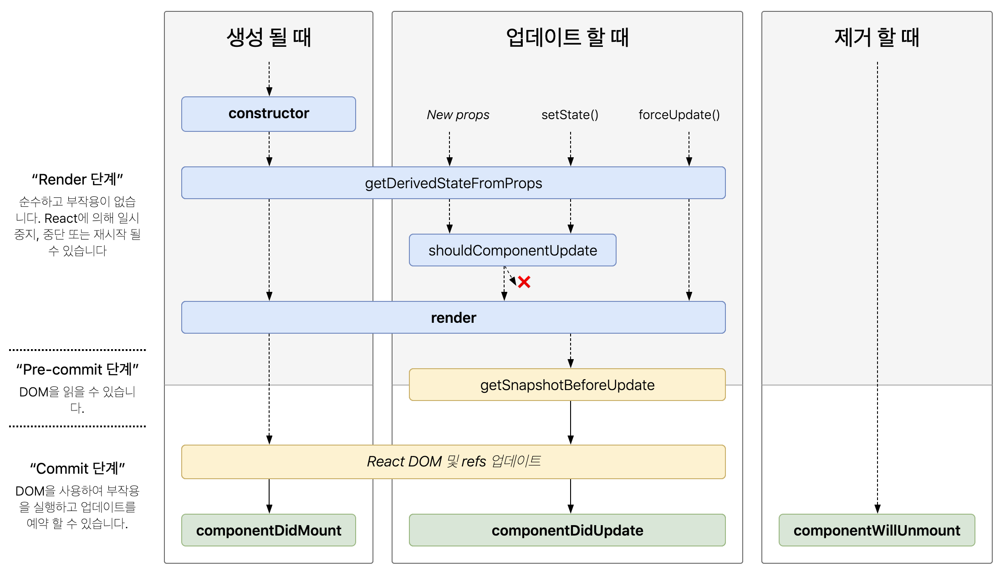

# React LifeCycle(리액트 생명주기)

컴포넌트의 생성부터 소멸까지의 과정입니다. 컴포넌트는 생명주기 마다 함수를 가지고 있는데 이 함수들을 이용하면 특정 시점에 원하는 동작(이벤트)을 하도록 만들 수 있습니다.



리액트 생명주기는 3단계로 이루어집니다.
**1단계** 는 **mounting(생성)** 으로 컴포넌트의 인스턴스가 생성되어 브라우저 DOM에 삽입되는 단계입니다.
이 단계에는 constructor(), getDerivedStateFromProps(), render() ,componentDidMount() 함수가 있습니다.

**2단계** 는 **updating(갱신)** 으로 이 단계에서 컴포넌트는 새로운 `props`를 보내거나, `setState()`, `forceUpdate()`를 통해서 `state`를 업데이트하는 방법으로 갱신됩니다.
이 단계에는 getDerivedStateFromProps(),shouldComponentUpdate(), render(), getSnapshotBeforeUpdate(), componentDidUpdate() 함수가 포함됩니다.

**3단계** 는 **unmounting(제거)** 으로 컴포넌트가 브라우저 DOM에서 제거됩니다. 여기에는 componentWillUnmount()가 포함됩니다.

## 생명 주기 함수(LifeCycle Methods)

React 16.3+

- `getDerivedStateFromProps`: 모든 `render()`가 실행되기 바로 직전에 호출됩니다. props의 변화의 결과로 내부 state 변화를 가능하게 해주는 함수로, 굉장히 드물게 사용됩니다.
- `componentDidMount`: 컴포넌트가 생성된 직후 호출됩니다. DOM 노드를 확인하고 초기화해야 하는 작업이 있는 경우 또는 외부의 데이터를 불러오거나 네트워크 요청을 보내야하는 경우 사용됩니다.
- `shouldComponentUpdate`: 컴포넌트가 업데이트 될지 말지를 결정합니다. default로 true를 리턴합니다. 만약 state나 props 업데이트 이후에 컴포넌트가 업데이트 될 필요가 없다고 생각한다면, false를 리턴하면 됩니다.이 경우 render(), componentDidUpdate()는 호출되지 않습니다. (컴포넌트가 새로운 props를 받은 후에, 리 렌더링을 방지해서 성능을 향상 시키기에 가장 좋은 위치)

  ```jsx
  // 새로운 Props, State가 추가되거나 변경될 시마다 호출며, 리렌더링(re-render) 여부 결정
  shouldComponentUpdate(nextProps, nextState) {
    return true; // 앱의 사용자에게 보여질 화면이 리렌더링(re-render)이 필요한 경우(기본값),
    return false; // 앱의 사용자에게 보여질 화면이 리렌더링(re-render)이 필요하지 않은 경우,
  }
  ```

- `getSnapshotBeforeUpdate`: 가장 마지막으로 렌더링된 결과가 DOM에 반영 되었을 때 호출됩니다.
  여기서 반환된 모든 값은 `componentDidUpdate()` 에 인자로 전달되고, 스크롤 위치 등 DOM에서 필요한 정보를 얻을 때 유용합니다.
- `componentDidUpdate`: prop/state의 변화의 응답으로 DOM을 업데이트 할 때 필요합니다.
  이 메소드는 만약 `shouldComponentUpdate()`가 `false`를 리턴하면 호출되지 않습니다.
- `componentWillUnmount`: 컴포넌트가 제거되기 직전에 호출됩니다. 타이머를 제거하거나, 네트워크 요청을 취소하거나, 컴포넌트와 관련된 이벤트 리스너를 삭제할 때 쓰입니다.

---

※ Reference

⭐️[리액트 공식문서 - state와 생명주기](https://ko.reactjs.org/docs/state-and-lifecycle.html)

⭐️[리액트 공식문서 - React.Component](https://ko.reactjs.org/docs/react-component.html)

🖼[LifeCycle methods diagram](https://github.com/wojtekmaj/react-lifecycle-methods-diagram)

[리액트 인터뷰 질문 - (20), (21)생명주기](https://www.edureka.co/blog/interview-questions/react-interview-questions/)
[https://velog.io/@cyranocoding/React-Life-Cycle-시리즈Mount-편](https://velog.io/@cyranocoding/React-Life-Cycle-%EC%8B%9C%EB%A6%AC%EC%A6%88Mount-%ED%8E%B8)

[https://medium.com/humanscape-tech/react-컴포넌트-생명주기-c7f45ef2d0be](https://medium.com/humanscape-tech/react-%EC%BB%B4%ED%8F%AC%EB%84%8C%ED%8A%B8-%EC%83%9D%EB%AA%85%EC%A3%BC%EA%B8%B0-c7f45ef2d0be)

[React Components, Elements, and Instances](https://medium.com/@dan_abramov/react-components-elements-and-instances-90800811f8ca)

[리액트 렌더링과 성능](https://meetup.toast.com/posts/110)
