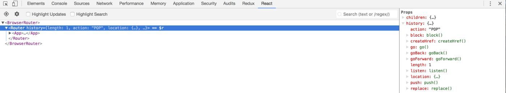

# React Routing

> <Understanding The Fundamentals of Routing in React> 내용을 번역하고, 추가적인 설명을 덧붙였습니다.

**라우팅(Routing)**은 리액트 어플리케이션 안에서 사용자가 URL을 입력하거나 어떤 요소(링크, 버튼, 아이콘, 이미지 등)을 클릭했을 때 자유롭게 이동할 수 있도록 하는 기능입니다.

뷰의 전환이 없는 간단한 프로젝트를 넘어 하나의 뷰에서 다른 뷰로 전환이 필요하다면 리액트의 라우팅에 대해 알고 있어야 합니다.

이 챕터에서 우리는 리액트 어플리케이션의 라우팅에 대해 알아보겠습니다. 라우팅이 가능하도록 어플리케이션을 확장하려면 React-Router 라이브러리를 활용합니다.

React-Router 라이브러리는 3가지로 나뉩니다.

- react-router: 코어 라이브러리 입니다. react-router-dom과 react-router-native를 합친 패키지 입니다.
- react-router-dom: 웹 어플리케이션 개발에 사용됩니다.
- react-router-native: 모바일 어플리케이션 개발에 사용됩니다.

상황에 따라서는 react-router 라이브러리를 설치할 필요없이 react-router-dom이나 react-router-native 중에서 선택합니다. react-router-dom과 react-router-native 모두 react-router 라이브러리의 기능들을 불러들일 수 있습니다.

웹 어플리케이션을 제작하는 이 프로젝트에서는 react-router-dom을 사용합니다.

```jsx
npm install --save react-router-dom
```

### Routers(라우터)

react-router package에는 대상 플랫폼에 따라 활용할 수 있는 여러 라우터가 포함되어 있습니다. 여기에는 `BrowserRouter`, `HashRouter`, `MemoryRouter` 등 여러 라우터가 있습니다.

우리가 만들고 있는 브라우저 기반의 어플리케이션은 `BrowserRouter` 와 `HashRouter` 가 적합합니다.

`BrowserRouter` 는 여러 타입의 URL을 다루는 동적인 서버를 가진 어플리케이션에 사용됩니다. 반면에 `HashRouter` 는 서버가 알려진 파일에 대한 요청에만 응답하는 정적인 웹 사이트에 사용됩니다.

우리는 동적인 서버를 가정하고 `BrowserRouter` 를 사용하겠습니다. 주목할 만한 점은 모든 라우터가 **_오직 하나의 자식_**만 받을 수 있다는 것입니다.

```jsx
ReactDOM.render(
  <BrowserRouter>
    <App/>
  </BrowserRouter>,
  document.getElementById(‘root’));
```

이 예제에서 `<App/>` 컴포넌트는 `<BrowserRouter>` 컴포넌트의 자식입니다. 이제 App 컴포넌트 안 어디에서나 발생할 수 있습니다. 하지만 모든 라우터를 그룹화하여 동일한 위치에 배치하는 것이 좋습니다. (나중에 이 부분은 또 언급하겠습니다.)

### History

각 라우터는 [history](https://github.com/ReactTraining/history) 객체를 생성하여 현재 위치를 추적하고, 이 위치가 변경될 때마다 어플리케이션을 다시 렌더링합니다. 때문에 다른 리액트 라우터 컴포넌트들은 history 객체가 현재에 존재하는 것에 신경씁니다. 이것이 라우터 컴포넌트들이 라우터 내부에서 렌더 되야 하는 이유입니다.

`<BrowserRouter>` 는 [HTML5 history](https://developer.mozilla.org/en-US/docs/Web/API/History_API) API를 사용하여 사용자 인터페이스가 브라우저 주소 표시줄의 URL과 동기화되도록 유지합니다.

라우터로부터 생성된 history 객체는 여러 속성을 가지는데 그 중 하나는 값이 객체인 location 속성입니다. location 속성이 우리가 이 챕터에서 가장 중점적으로 보는 부분입니다. (다른 속성은 이 책의 범위를 넘기 때문입니다.)

브라우저에 이전 예제가 렌더링 될 때, history 객체가 생성될 것을 React DevTool 창에서 확인할 수 있습니다.



history 객체 안의 location 객체는 아래와 같은 구조를 가지고 있습니다.

```jsx
{
  pathname, search, hash, state;
}
```

location 객체의 속성들은 어플리케이션 URL로부터 파생된 것입니다.
