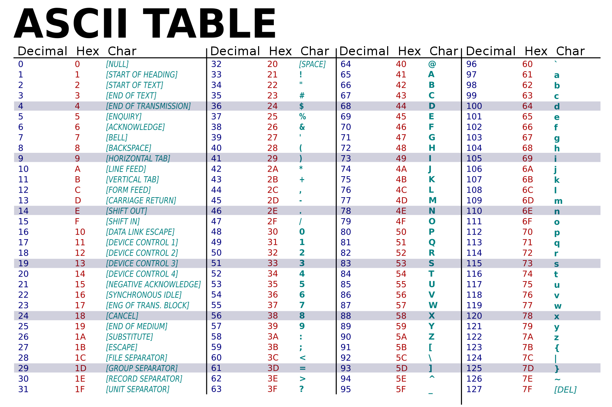

# Character Encoding(문자열 인코딩)

  * 컴퓨터가 문자를 `2진수`로 변환(코드로 표현)하는 방식

    ex) `ASCII`, `EUC-KR`, `Unicode`(`UTF-8`, `UTF-16`, `UTF-32`)

  > ### 💡글자가 깨지거나 보이지 않는 문제가 발생하는 이유?
  > * 초기 컴퓨터는 영어와 일부 특수 문자만 지원. 따라서 국가별 언어를 표현하는 독자적 규칙이 형성
  > * 운영체제, 개발 환경 별 문자열 인코딩 방식이 달라 호환되지 않는 문제가 발생

  ## 1. ASCII Code(아스키 코드, American Standard Code for Information Interchange)

  * 처음으로 정립한 표준
  * **영문 알파벳**을 사용하는 대표적인 문자 인코딩 방식
    * 대문자, 소문자, 아라비아 숫자, 공백 및 특수 문자
    * 0 ~ 127(총 128자)의 숫자로 문자 표현

    

    ```js
    let str = "hello";

    for(let idx in str) {
      console.log(str.charCodeAt(idx))
    }
    // 104 101 108 108 111
    ```

  ## 2. EUC-KR(CP949)

  * **한글**을 표현하기 위한 문자열 인코딩 방식
    * 16bit(2byte) 고정적으로 사용
  * 모든 글자가 완성된 형태로 존재하는 **완성형 코드**

    > 현재는 UTF-8로 변경 권장

  ## 3. Unicode(유니코드)

  * Universal Character Set(**Superset** of other encoded character sets)
  * 국제 표준화 기구(ISO)에서 만든 **동일한 규칙**으로 모든 언어 표현하는 문자열 인코딩 방식

  ### 3-1. UTF-8

  * 8bit(1byte)로 인코딩
  * ASCII 코드와 완벽히 호환. 1 ~ 6byte까지 사용 가능
    
    > 대부분의 환경에서 호환. `JSON`은 UTF-8 인코딩만 지원

  ### 3-2. UTF-16(Multi-Byte)

  * 16bit(일반 문자2byte 또는 특수 문자 4byte)로 인코딩 
  * ASCII 코드와 호환되지 않음

    > Java, Window 환경에서 호환

  ### 3-2. UTF-32

  * 32bit(4byte) 고정적으로 사용

    > 반드시 사용해야 하는 환경 아니면 권장 안함 (HTML5에서는 사용이 금지)


  

***

### Reference

[Character encoding: Essential concepts | W3](https://www.w3.org/International/articles/definitions-characters/)

[Character encoding | Wiki](https://ko.wikipedia.org/wiki/%EB%AC%B8%EC%9E%90_%EC%9D%B8%EC%BD%94%EB%94%A9)

[한글 인코딩의 이해 | d2](https://d2.naver.com/helloworld/19187)