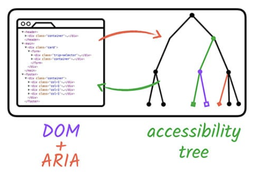

# WAI-ARIA, or ARIA

> Web Accessibility Initiative's Accessible Rich Internet Applications specification

- 네이티브 HTML만으로 다룰 수 없는 **접근성(Accessibility)** 문제를 해결합니다.

```html
<!-- Example #1 -->
<li tabindex="0" class="checkbox" role="checkbox" checked aria-checked="true">
  Receive promotional offers
</li>
<!-- Example #2 -->
<button type="button" aria-label="Close">X</button>
<!-- Example #3 -->
<span id="night-mode-label">Night mode</span>
<span
  role="switch"
  aria-checked="false"
  tabindex="0"
  aria-labelledby="night-mode-label"
></span>
<!-- OR -->
<label for="night-mode">Night mode</label>
<input type="checkbox" role="switch" id="night-mode" />
```

- `ARIA`를 통해 페이지 상 모든 요소에 대한 접근성 트리를 수정 가능합니다.



### Reference

[WAI-ARIA | W3](https://www.w3.org/TR/wai-aria/)

[WAI-ARIA Authoring Practices](https://www.w3.org/TR/wai-aria-practices-1.1/)

[ARIA | MDN](https://developer.mozilla.org/en-US/docs/Web/Accessibility/ARIA)

[ARIA Roles | MDN](https://developer.mozilla.org/en-US/docs/Web/Accessibility/ARIA/Roles)

[ARIA Labels and Relationships](https://developers.google.com/web/fundamentals/accessibility/semantics-aria/aria-labels-and-relationships)

[레진 WAI-ARIA 가이드라인 소개](https://tech.lezhin.com/2018/04/20/wai-aria)
