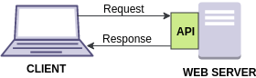

# Web API

## API(Application Programming Interfaces)
* 복잡한 기능을 쉽게 만들 수 있도록 제공되는 프로그래밍 언어의 구성 요소
  * 복잡한 코드를 **추상화**하며 사용하기 쉬운 문법을 제공한다.

* 한 프로그램(제공자)에서 다른 프로그램(사용자)으로 데이터를 주고받기 위한 방법
  * 코드에 요청방식(GET, POST 등), 엔드포인트(데이터 종류), 파라미터(추가 정보)를 담아서 통신한다. 
  
  
  ```
  GET/google.com/search?q=keyword&sourceid=chrome&ie=UTF-8
  ```

## Client-side JavaScript API
* 자바스크립트 언어의 일부가 아니라 핵심 자바스크립트 위에 구축되어 있다.

### 1️⃣Browser(브라우저) APIs

* 웹 브라우저에 내장되어 브라우저와 주변 컴퓨터 환경에서 데이터를 노출하고 복잡한 작업을 수행할 수 있다.
  > 예를 들어, [웹 오디오 API](https://developer.mozilla.org/en-US/docs/Web/API/Web_Audio_API)는 브라우저의 오디오를 조작 — 오디오 트랙을 사용하고 볼륨을 변경하고 이펙트를 적용하는 등 — 하기 위한 자바스크립트 구성 요소를 제공한다. 백그라운드에서 브라우저는 실제 오디오 처리를 위해 복잡한 하위 레벨 코드(예: C++ 또는 러스트)를 사용하고 있지만 API에 의해 이러한 복잡성이 추상화됩니다.

* [DOM API](https://developer.mozilla.org/en-US/docs/Web/API/Document_Object_Model), [Fetch API](https://developer.mozilla.org/en-US/docs/Web/API/Fetch_API), Canvas, WebGL, [Web Storage API](https://developer.mozilla.org/en-US/docs/Web/API/Web_Storage_API) 등이 있다.

### 2️⃣Third-party APIs

* 웹 브라우저에 내장되어 있지 않으며, 일반적으로 웹의 다른 곳에서 해당 API의 코드와 정보를 검색해야 한다. 
  > 예를 들어, [트위터 API](https://developer.twitter.com/en/docs)를 사용하면 웹 사이트에 최신 트윗을 표시하는 것과 같은 작업을 할 수 있다. 트위터 서비스를 쿼리하고 특정 정보를 반환하는 데 사용할 수 있는 특별한 구성 요소 집합을 제공한다.

* [YouTube API](https://developers.google.com/youtube/), [Pinterest API](https://developers.pinterest.com/) 등이 있다. 


***
### Reference

🔗[Introduction to web API | MDN](https://developer.mozilla.org/en-US/docs/Learn/JavaScript/Client-side_web_APIs/Introduction#what_are_apis)

📹[API가 뭐냐면 | 코딩애플](https://www.youtube.com/watch?v=ckSdPNKM2pY)


